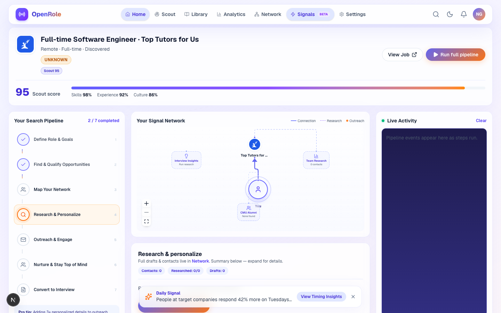
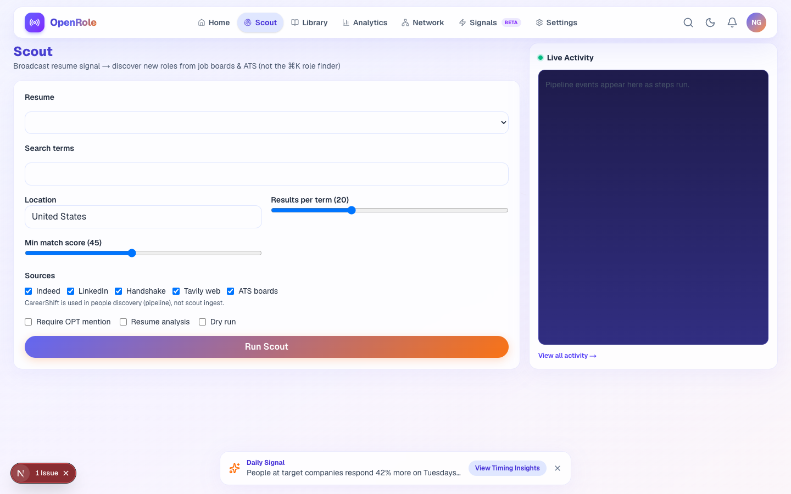
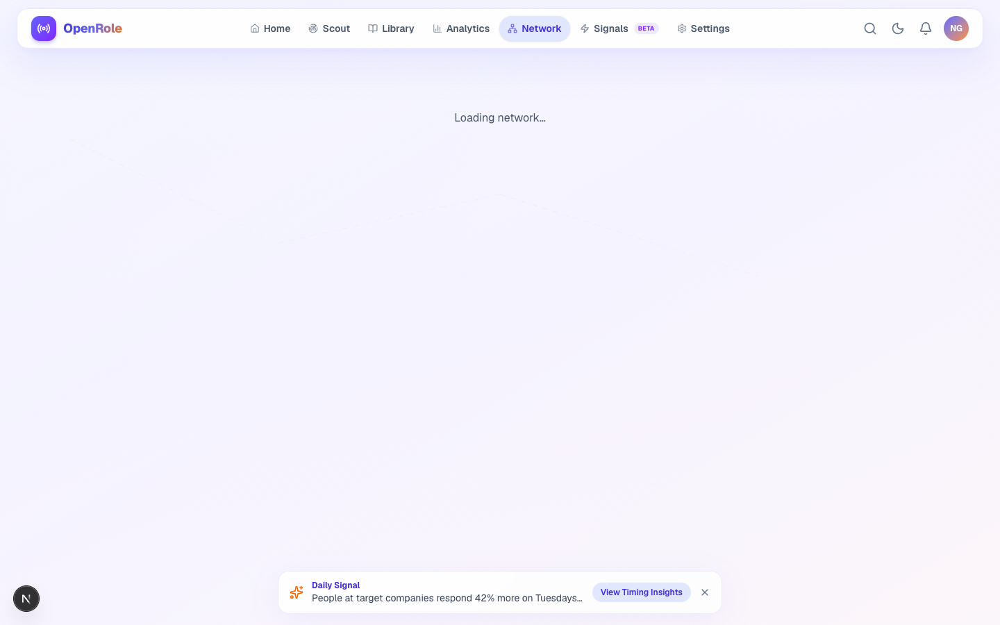

# OpenRole

Job search mission control: discover roles, map companies, find people, draft outreach — with human review at every send step.

**Repo:** https://github.com/NisargaGondi/openrole

---

## What's new

OpenRole now ships a **Next.js Signal UI** (`web/`) backed by a **FastAPI API** (`src/openrole/api/`). The Streamlit app remains for legacy workflows.

| Page | Purpose |
|------|---------|
| **Home / Signals** | Mission control — job header, pipeline rail, network graph, step workspace |
| **Scout** | Multi-source job discovery (Indeed, Handshake, ATS boards, Tavily) |
| **Network** | Company-centric view of contacts, research, and outreach drafts |
| **Library** | Saved jobs and ingestion |
| **Settings** | API key status and profile configuration |







---

## Quick start

**Requirements:** Python 3.11+, Node 20+, git.

```bash
git clone https://github.com/NisargaGondi/openrole.git
cd openrole

python3 -m venv .venv
source .venv/bin/activate
pip install -e ".[dev]"

cp .env.example .env          # edit locally — never commit .env
openrole-migrate
pytest                        # 223 tests

# Terminal 1 — API
bash scripts/run_api.sh

# Terminal 2 — web UI
cd web && npm install && cp .env.local.example .env.local
bash ../scripts/run_web.sh
```

Open **http://localhost:3000**. API runs at **http://127.0.0.1:8000**.

Optional: `bash scripts/run_streamlit.sh` for the legacy Streamlit UI on port 8501.

---

## LLM providers

Set `LLM_PROVIDER=auto|vertex|openrouter|openai` in `.env`.

| Provider | Keys | Notes |
|----------|------|-------|
| **OpenRouter** | `OPENAI_API_KEY=sk-or-...` + `OPENAI_API_BASE=https://openrouter.ai/api/v1` | Recommended for local dev — free/cheap models |
| **Vertex** | `GCP_PROJECT_ID` + ADC or service account | Gemini via Google Cloud |
| **OpenAI** | `OPENAI_API_KEY` | Direct OpenAI API |

With `auto`, OpenRole picks the first configured provider (OpenRouter/OpenAI, then Vertex).

Per-task model overrides: `OPENAI_MODEL_INGESTION`, `OPENAI_MODEL_DEFAULT`, `OPENAI_MODEL_WRITING`.

---

## Security — do not commit secrets

These are **gitignored** and must stay local:

| Path | Contains |
|------|----------|
| `.env` | All API keys, resume paths, DB URL |
| `web/.env.local` | `NEXT_PUBLIC_API_URL` |
| `gen-lang-client-*.json` / `*-service-account*.json` | GCP credentials |
| `data/` | SQLite DB, scout logs, checkpoints |
| `.openrole/` / `.handshake-mcp/` | Browser login sessions (CareerShift, Handshake) |

Only commit `.env.example` and `web/.env.local.example` with placeholders.

Before pushing, run:

```bash
python scripts/check_env.py    # validates config without printing secrets
git status                     # confirm .env is not staged
```

If a key was ever committed, rotate it immediately.

---

## What it does

1. **Parse roles** — URL or pasted JD → structured job + company domain
2. **Find people** — Tavily + Apollo + CareerShift; ranked by relevance
3. **Research contacts** — briefs with talking points
4. **Draft outreach** — email + LinkedIn (review only, never auto-send)
5. **Scout** — scheduled multi-board discovery filtered by resume + OPT/sponsorship
6. **Sync** — optional Notion / Google Sheets export

---

## Scout (CLI)

```bash
python scripts/run_scout.py
python scripts/run_scheduled_scout.py --resume-label 'resume_ML.pdf'
```

Company targets: `data/scout_targets.yaml` → `python scripts/seed_companies.py`.

Env knobs: `SCOUT_REFETCH_PARALLEL_WORKERS`, `SCOUT_LLM_PARALLEL_WORKERS`, `OPENROLE_HANDSHAKE_HEADLESS=false` (visible browser for Handshake login).

---

## Project layout

```
openrole/
├── web/                    # Next.js Signal UI
├── src/openrole/
│   ├── api/                # FastAPI routes
│   ├── agents/             # ingestion, scout, people, outreach
│   ├── graph/              # LangGraph pipeline
│   ├── scrapers/           # ATS, Handshake, CareerShift, Indeed
│   └── db/                 # SQLAlchemy + SQLite (default)
├── scripts/                # run_api.sh, run_web.sh, scout, daemons
├── tests/                  # pytest (223)
├── docs/images/            # UI screenshots
└── .env.example            # template only
```

---

## Optional integrations

```bash
bash scripts/install_jobspy.sh
bash scripts/install_handshake.sh && python scripts/handshake_login.py
bash scripts/install_careershift.sh && python scripts/careershift_login.py
```

| Key | Purpose |
|-----|---------|
| `TAVILY_API_KEY` | People discovery + ATS/careers search |
| `APOLLO_API_KEY` + `APOLLO_ENABLED=true` | People search (credit-based) |
| `NOTION_*` / `GOOGLE_SHEETS_*` | Job sync |

---

## Ethics

- Outreach is **draft-only** — nothing sends without you.
- Verify contacts before reaching out.
- Respect platform ToS; no credentials in git.

---

## License

TBD — likely MIT for code. Personal resumes, drafts, and contact data stay local.
